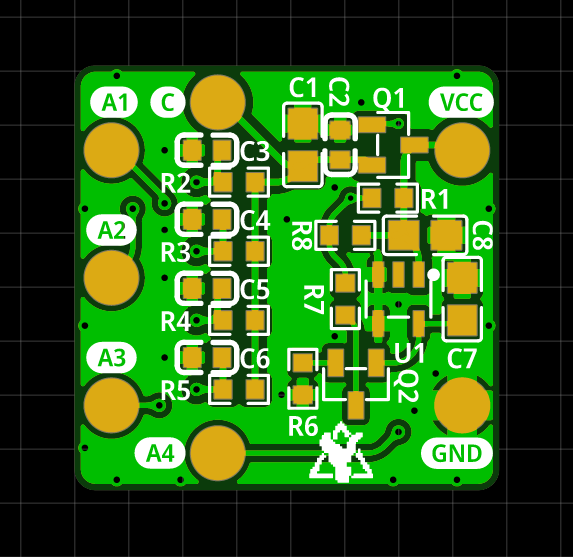

# MicroFC SiPM Array Board

Carrier board for a 2 x 2 array of the 6 mm C-Series MICROFC-60035-SMT silicon photomultipliers by [onsemi](https://www.onsemi.com/pdf/datasheet/microc-series-d.pdf).

PCB size is 20 x 20 mm. The solder pads for the SiPM are slightly bigger than they need to so that you can easily hand-solder everything! You can buy all the parts and the PCB using [Kitspace](https://kitspace.org/boards/github.com/opengammaproject/MicroFC-SiPM-Array-Board/).

  
  

On the front side there are only the 4 sensors themselves while all the other parts are on the back. This ensures good optical contact and light-tight sealing. The PCB includes some bias filtering for the 4 SiPMs that must also be soldered and an optional temperature compensation circuit! The temperature compensation takes care of the change in bias voltage and therefore gain depending on the ambient temperature.

The SiPMs all share a common cathode with bulk decoupling and an R-C low-pass filter each. The anodes are **not** connected together so that you can have some spatial resolution if you want to. You could mount a very small scintillator to each sensor and then have a four pixel gamma-ray camera, yay I guess?!

However, you can also connect all four SiPMs in parallel to a common output by connecting the anode pads to each other, e.g. by connecting the wires that you solder to the pads. You will obviously lose any spatial resolution, but this way you can use it just like a single SiPM in the 4P configuration. SNR should be pretty much the same as with a single SiPM, but your active area will be 4x that of a single one!

To orient the SiPM correctly, look at the notches at the side of the plastic casing. There are 2 lines at the dot right here, that must be matched up with the dot on the PCB. There are numbered dots on the PCB that have to be matched up with that.

  
  

