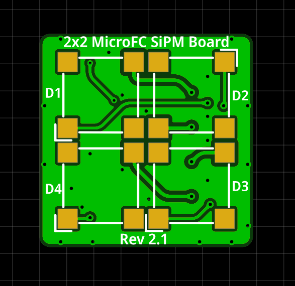
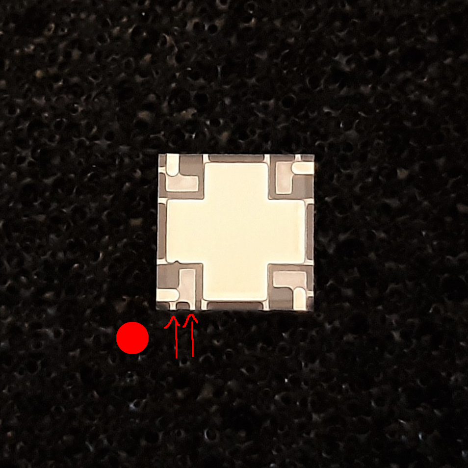

# MicroFC SiPM Array Board

Carrier board for a 2 x 2 array of the 6 mm C-Series MICROFC-60035-SMT silicon photomultipliers by [onsemi](https://www.onsemi.com/pdf/datasheet/microc-series-d.pdf).

PCB size is 22.6 x 18.5 mm. The solder pads for the SiPM are slightly bigger than they need to so that you can easily hand-solder everything! You can buy all the parts and the PCB using [Kitspace](https://kitspace.org/boards/github.com/opengammaproject/MicroFC-SiPM-Array-Board/).

  
  

On the front side there are only the 4 sensors themselves while all the other parts are on the back. This ensures good optical contact and light-tight sealing. The PCB includes some bias filtering for the 4 SiPMs that must also be soldered.

All the SiPMs all share a common cathode with bulk decoupling and an R-C low-pass filter each. The anodes are **not** connected together so that you can have some space resolution if you want to.

However, if you wish you can also close the 4 onboard jumpers (`JP1` - `JP4`), which will then connect all SiPMs in parallel to a common anode. You will obviously lose any space resolution, but this way you can use it just like a single SiPM in the 4P configuration.

To orient the SiPM correctly, look at the notches at the side of the plastic casing. There are 2 lines at the dot right here, that must be matched up with the dot on the PCB.

